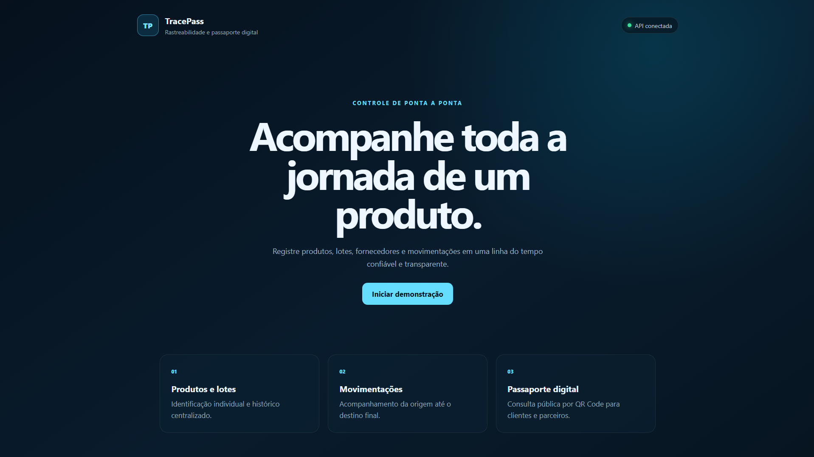
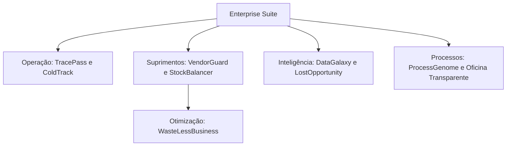

# Enterprise Suite

Ecossistema modular de soluções empresariais desenvolvido para rastreabilidade, automação, inteligência operacional e integração de dados.


## Visão do projeto

A Enterprise Suite foi idealizada como uma coleção de sistemas empresariais que podem funcionar individualmente ou de maneira integrada.

Cada módulo resolve um problema específico da operação empresarial. Quando combinados, os módulos formam uma plataforma centralizada com indicadores, automações, mapas, alertas e compartilhamento de informações.

O objetivo é demonstrar não apenas desenvolvimento de telas, mas também:

- Modelagem de regras de negócio.
- Construção de APIs REST.
- Persistência e versionamento de dados.
- Automações empresariais.
- Integração entre diferentes sistemas.
- Monitoramento operacional.
- Segurança e rastreabilidade.
- Experiência visual para usuários técnicos e não técnicos.

## Primeiro módulo funcional

### TracePass

O TracePass é o primeiro sistema desenvolvido dentro da Enterprise Suite.

Ele acompanha a jornada completa de produtos e lotes, desde o fornecedor de origem até o destino final.



Principais recursos:

- Empresas, produtos, fornecedores e lotes.
- Linha do tempo rastreável.
- Rota geográfica em mapa.
- Passaporte digital público.
- QR Code para consulta externa.
- Registro de ocorrências operacionais.
- Bloqueio automático de lotes.
- Investigação, resolução e liberação controlada.
- Histórico público de segurança.
- Documentação Swagger.
- Testes automatizados.

[Consultar documentação completa do TracePass](apps/tracepass/README.md)


### Acessos online

- [Abrir demonstração do TracePass](https://tracepass-enterprise.vercel.app)
- [Consultar API publicada](https://tracepass-api.onrender.com)
- [Abrir documentação Swagger](https://tracepass-api.onrender.com/swagger-ui/index.html)
- [Verificar saúde da API](https://tracepass-api.onrender.com/actuator/health)

> A API utiliza uma instância gratuita para demonstração. No primeiro acesso, ela pode levar alguns segundos para iniciar.

## Módulos da plataforma

| Módulo | Objetivo | Situação |
|---|---|---|
| **TracePass** | Rastreabilidade de produtos, lotes, fornecedores e movimentações | MVP funcional |
| **ColdTrack** | Monitoramento da cadeia fria, temperatura e condições de transporte | Planejado |
| **VendorGuard** | Avaliação de fornecedores, riscos, documentos e conformidade | Planejado |
| **StockBalancer** | Análise e redistribuição de estoque entre unidades e filiais | Planejado |
| **WasteLessBusiness** | Identificação e redução de desperdícios empresariais | Planejado |
| **DataGalaxy** | Visualização interativa das relações entre dados empresariais | Planejado |
| **LostOpportunity** | Detecção de oportunidades comerciais perdidas | Planejado |
| **ProcessGenome** | Mapeamento de processos, gargalos e possibilidades de automação | Planejado |
| **Oficina Transparente** | Ordem de serviço digital com progresso visual e comunicação com clientes | Planejado |

## Modelo de integração



Os módulos foram planejados para serem utilizados de duas maneiras:

### Uso independente

Uma empresa pode contratar ou utilizar apenas o sistema necessário para sua operação.

Exemplos:

- TracePass para rastreabilidade.
- ColdTrack para monitoramento de temperatura.
- VendorGuard para fornecedores.
- StockBalancer para controle de estoque.

### Uso integrado

Os módulos poderão compartilhar empresas, filiais, produtos, fornecedores, alertas e indicadores dentro de um painel central.

Exemplos de integração:

- ColdTrack adicionando eventos de temperatura ao TracePass.
- VendorGuard fornecendo indicadores de risco dos fornecedores.
- WasteLessBusiness utilizando informações do StockBalancer.
- DataGalaxy conectando informações de todos os módulos.
- ProcessGenome identificando processos que podem ser automatizados.

## Tecnologias principais

A plataforma utiliza uma base tecnológica voltada para aplicações empresariais:

### Backend

- Java
- Spring Boot
- APIs REST
- Spring Data JPA
- Hibernate
- Jakarta Validation
- Flyway
- PostgreSQL
- Maven
- JUnit
- Mockito
- Swagger e OpenAPI

### Frontend

- React
- TypeScript
- Vite
- Mapas interativos
- Interfaces responsivas
- Dashboards empresariais

### Infraestrutura

- Docker
- Docker Compose
- Git
- Health checks
- Configuração por variáveis de ambiente

## Estrutura atual

```text
enterprise-suite
├── apps
│   └── tracepass
│       ├── backend
│       ├── frontend
│       ├── docs
│       ├── compose.yaml
│       └── README.md
└── README.md
```

Cada novo módulo será adicionado dentro da pasta `apps`, mantendo código, documentação e demonstração independentes.

## Estratégia de desenvolvimento

Cada projeto da Enterprise Suite seguirá as seguintes etapas:

1. Definição do problema empresarial.
2. Modelagem das regras de negócio.
3. Criação do banco de dados.
4. Desenvolvimento da API.
5. Testes automatizados.
6. Desenvolvimento da interface.
7. Criação da demonstração visual.
8. Documentação técnica.
9. Integração com os demais módulos.
10. Publicação para demonstração.

## Diferenciais

- Projetos orientados a problemas empresariais reais.
- Sistemas independentes e integráveis.
- Regras de negócio além de operações básicas de cadastro.
- Interfaces visuais para facilitar demonstrações.
- Arquitetura preparada para evolução gradual.
- Documentação técnica e funcional.
- Automação de decisões operacionais.
- Histórico e rastreabilidade de dados.

## Roadmap

- [x] Definir a arquitetura inicial da Enterprise Suite.
- [x] Desenvolver o MVP do TracePass.
- [x] Criar a demonstração visual do TracePass.
- [x] Documentar a API com Swagger.
- [x] Criar testes automatizados.
- [x] Publicar o TracePass em ambiente de demonstração.
- [ ] Criar autenticação e controle de acesso.
- [ ] Desenvolver o ColdTrack.
- [ ] Integrar ColdTrack e TracePass.
- [ ] Desenvolver os demais módulos.
- [ ] Criar o painel agregador da Enterprise Suite.

## Autor

Desenvolvido por **Enzo Teixeira Alves** como projeto de portfólio voltado para desenvolvimento Java Backend e soluções empresariais.

Portfólio: [portifolio-enzo-xi.vercel.app](https://portifolio-enzo-xi.vercel.app)