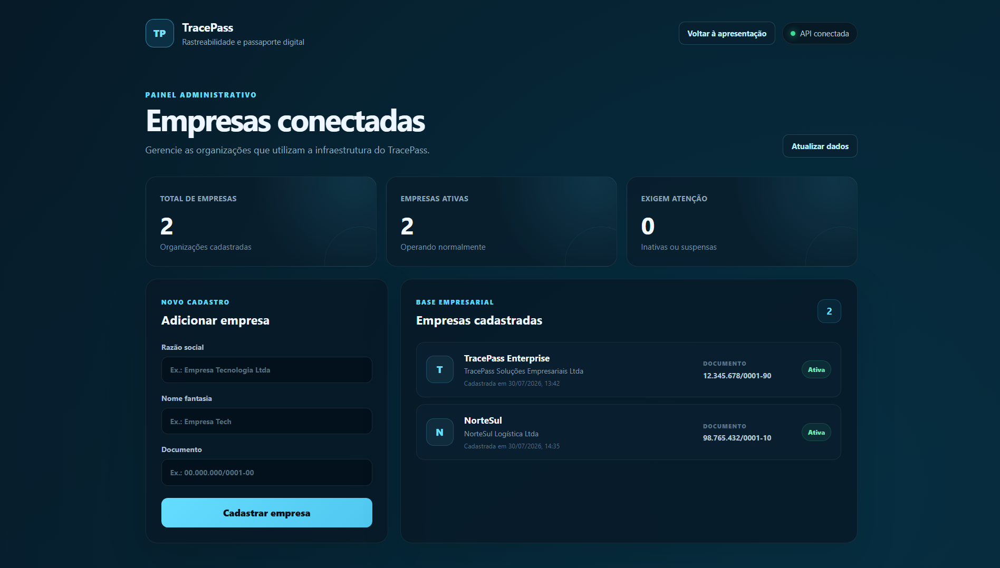
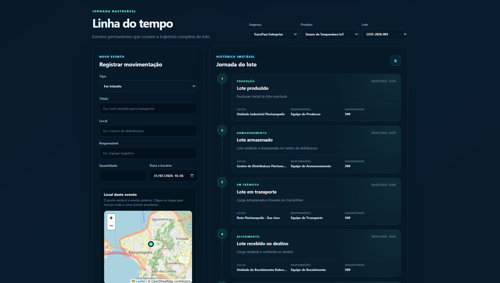
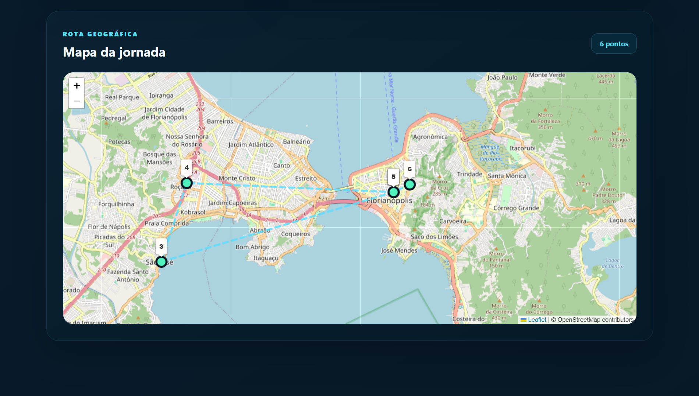
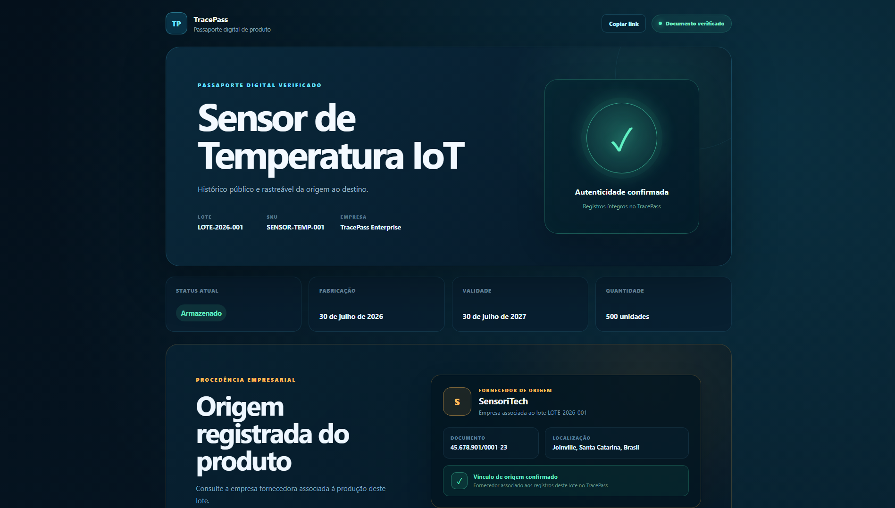
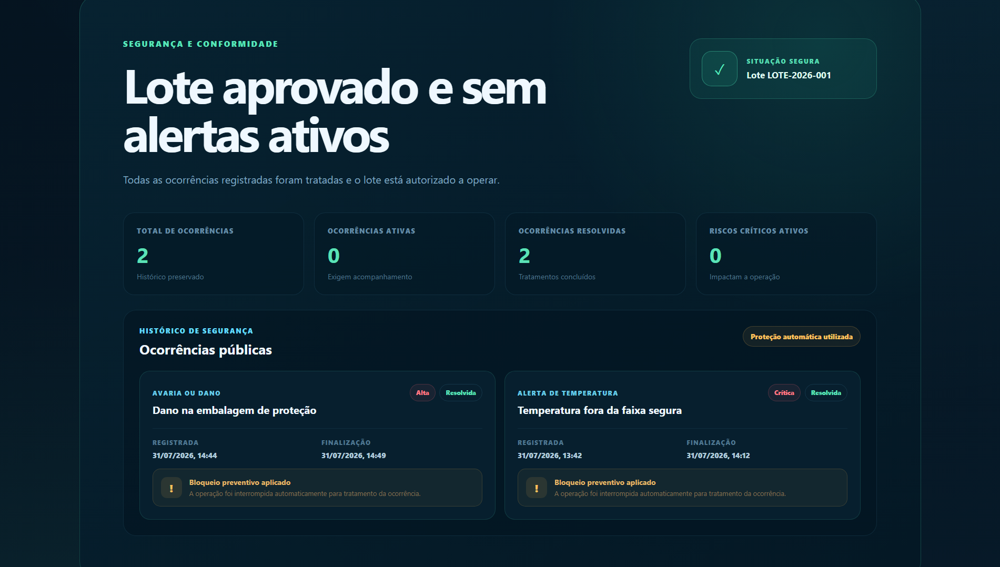
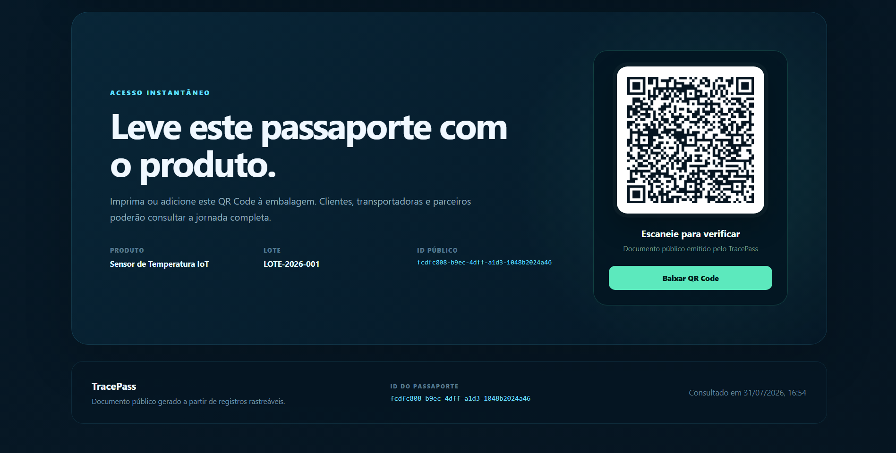
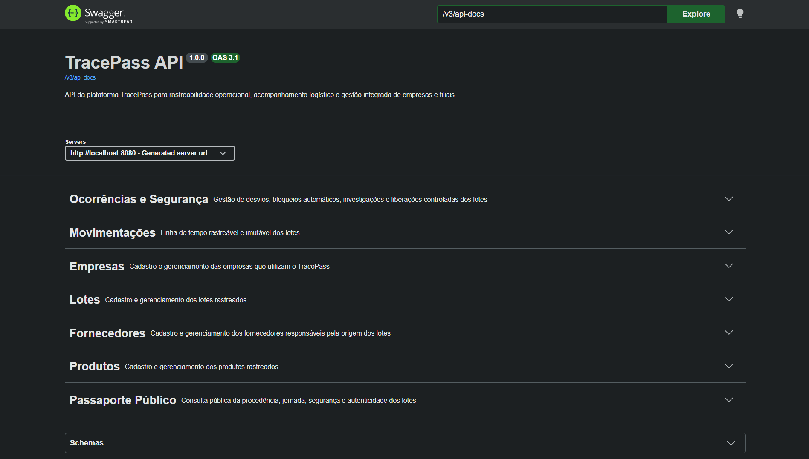
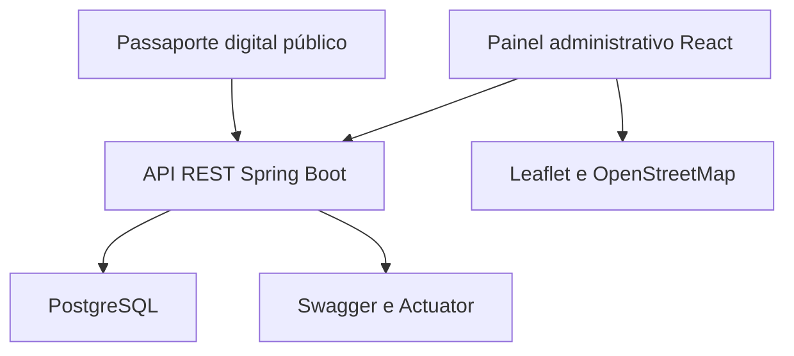

# TracePass

Plataforma empresarial de rastreabilidade que acompanha a jornada completa de produtos e lotes, desde o fornecedor de origem até o destino final.


## Visão geral

O TracePass foi desenvolvido para oferecer transparência, segurança e controle sobre a cadeia de movimentação de produtos.

A plataforma centraliza empresas, fornecedores, produtos, lotes, movimentações logísticas e ocorrências operacionais. Cada lote recebe um passaporte digital público com histórico cronológico, mapa da jornada, procedência empresarial, QR Code e situação de segurança.

O projeto pode funcionar de maneira independente ou integrado a outros módulos da Enterprise Suite, como o ColdTrack para monitoramento de temperatura.

## Demonstração visual

> As capturas abaixo utilizam dados demonstrativos para apresentar os principais fluxos do sistema.

### Apresentação do TracePass


### Painel administrativo

Gestão centralizada das empresas conectadas à plataforma.



### Linha do tempo rastreável

Histórico cronológico e permanente da jornada de cada lote.



### Rota geográfica

Visualização dos eventos registrados e da trajetória do produto no mapa.



### Passaporte digital público

Documento público com autenticidade, procedência e informações do lote.



### Segurança operacional

Histórico de ocorrências, bloqueios preventivos e tratamentos concluídos.



### QR Code do produto

Acesso ao passaporte digital por meio de um QR Code que pode ser adicionado à embalagem.



### Documentação da API

API REST organizada e documentada com Swagger e OpenAPI.



## Problemas que o projeto resolve

- Falta de visibilidade sobre a origem dos produtos.
- Informações logísticas espalhadas em diferentes sistemas.
- Dificuldade para acompanhar a jornada de um lote.
- Ausência de um histórico confiável de movimentações.
- Falta de controle sobre desvios, danos e alertas.
- Continuidade indevida da operação após uma ocorrência crítica.
- Dificuldade para apresentar informações ao cliente final.

## Principais funcionalidades

### Gestão empresarial

- Cadastro e gerenciamento de empresas.
- Cadastro de fornecedores e procedência empresarial.
- Cadastro de produtos por empresa.
- Cadastro e controle de lotes.
- Associação entre fornecedor, produto e lote.

### Rastreabilidade

- Linha do tempo cronológica dos lotes.
- Registro de produção, armazenamento e transporte.
- Registro de despacho, recebimento e conclusão.
- Registro da localização geográfica de cada evento.
- Visualização da rota em mapa interativo.
- Histórico permanente das movimentações.

### Segurança operacional

- Registro de ocorrências de rastreabilidade.
- Classificação por tipo e gravidade.
- Estados de ocorrência aberta, em investigação e resolvida.
- Bloqueio automático para ocorrências graves ou críticas.
- Controle de investigação e resolução.
- Liberação controlada depois do tratamento das ocorrências.
- Registro da liberação na linha do tempo do lote.

### Passaporte digital público

- Consulta pública por identificador único.
- Informações do produto, lote e empresa.
- Procedência e fornecedor de origem.
- Histórico completo de movimentações.
- Mapa geográfico da jornada.
- Histórico público de segurança.
- Status de autenticidade e conformidade.
- Geração e download de QR Code.
- Link compartilhável para consulta externa.

### Documentação e monitoramento

- Documentação interativa da API com Swagger/OpenAPI.
- Monitoramento da aplicação com Spring Boot Actuator.
- Migrações versionadas do banco de dados com Flyway.
- Testes automatizados dos principais fluxos de negócio.

## Arquitetura



O frontend administrativo e o passaporte público consomem a mesma API REST. A API aplica as regras de negócio e utiliza PostgreSQL para preservar os registros.

## Tecnologias utilizadas

### Backend

- Java 21
- Spring Boot 4
- Spring Web MVC
- Spring Data JPA
- Hibernate
- Jakarta Validation
- Flyway
- PostgreSQL
- Spring Boot Actuator
- Swagger e OpenAPI
- Maven
- JUnit 5
- Mockito

### Frontend

- React 19
- TypeScript
- Vite
- React Leaflet
- Leaflet
- OpenStreetMap
- QR Code
- CSS responsivo

### Infraestrutura

- Docker Desktop
- Docker Compose
- PostgreSQL 17 Alpine
- Git

## Estrutura do projeto

```text
apps/tracepass
├── backend
│   └── tracepass-api
│       ├── src/main/java
│       ├── src/main/resources
│       │   └── db/migration
│       ├── src/test/java
│       ├── mvnw.cmd
│       └── pom.xml
├── frontend
│   ├── src
│   ├── package.json
│   └── vite.config.ts
├── .env.example
├── compose.yaml
└── README.md
```

## Fluxo principal

1. Uma empresa é cadastrada.
2. A empresa registra seus fornecedores.
3. Um produto é cadastrado.
4. Um lote é criado e associado ao fornecedor de origem.
5. As movimentações são adicionadas à linha do tempo.
6. Cada movimentação pode conter localização geográfica.
7. Ocorrências podem bloquear automaticamente o lote.
8. A equipe investiga e resolve as ocorrências.
9. O lote somente retorna à operação após uma liberação controlada.
10. O cliente consulta toda a jornada pelo passaporte digital público.

## Endpoints principais

| Método | Endpoint | Finalidade |
|---|---|---|
| `GET/POST` | `/api/companies` | Consultar e cadastrar empresas |
| `GET/POST` | `/api/companies/{companyId}/suppliers` | Gerenciar fornecedores |
| `GET/POST` | `/api/companies/{companyId}/products` | Gerenciar produtos |
| `GET/POST` | `/api/companies/{companyId}/products/{productId}/batches` | Gerenciar lotes |
| `GET/POST` | `/api/companies/{companyId}/products/{productId}/batches/{batchId}/movements` | Consultar e registrar movimentações |
| `GET/POST` | `/api/companies/{companyId}/products/{productId}/batches/{batchId}/incidents` | Consultar e registrar ocorrências |
| `PATCH` | `/api/companies/{companyId}/products/{productId}/batches/{batchId}/incidents/{incidentId}/investigation` | Iniciar investigação |
| `PATCH` | `/api/companies/{companyId}/products/{productId}/batches/{batchId}/incidents/{incidentId}/resolve` | Resolver ocorrência |
| `POST` | `/api/companies/{companyId}/products/{productId}/batches/{batchId}/release` | Autorizar liberação do lote |
| `GET` | `/api/public/passports/{batchId}` | Consultar passaporte público |

A relação completa de endpoints pode ser consultada no Swagger.

## Como executar localmente

### Pré-requisitos

Antes de iniciar, instale:

- Git
- Java JDK 21
- Node.js e npm
- Docker Desktop

### 1. Configurar o ambiente

Na pasta do TracePass, copie o arquivo de exemplo:

```powershell
cd apps\tracepass

Copy-Item .env.example .env
```

Confira os valores locais do PostgreSQL no arquivo `.env`.

O arquivo `.env` contém configurações locais e não deve ser enviado ao repositório.

### 2. Iniciar o PostgreSQL

```powershell
docker compose up -d
```

Verifique se o banco está saudável:

```powershell
docker compose ps
```

### 3. Iniciar o backend

```powershell
cd backend\tracepass-api

.\mvnw.cmd spring-boot:run
```

A API ficará disponível em:

```text
http://localhost:8080
```

### 4. Iniciar o frontend

Abra outro terminal:

```powershell
cd apps\tracepass\frontend

npm install
npm run dev
```

O frontend ficará disponível em:

```text
http://localhost:5173
```

## Endereços úteis

| Serviço | Endereço |
|---|---|
| Aplicação web | `http://localhost:5173` |
| API | `http://localhost:8080` |
| Saúde da API | `http://localhost:8080/actuator/health` |
| Swagger | `http://localhost:8080/swagger-ui/index.html` |
| OpenAPI JSON | `http://localhost:8080/v3/api-docs` |

## Testes

Para executar os testes automatizados do backend:

```powershell
cd apps\tracepass\backend\tracepass-api

.\mvnw.cmd test
```

Resultado atual:

```text
Tests run: 7
Failures: 0
Errors: 0
Skipped: 0
```

Para verificar o frontend:

```powershell
cd apps\tracepass\frontend

npm run build
```

## Regras de negócio demonstradas

- Um código de lote não pode se repetir no mesmo produto.
- A validade não pode ser anterior à fabricação.
- A quantidade atual não pode superar a quantidade inicial.
- Latitude e longitude devem ser informadas juntas.
- Ocorrências graves ou críticas podem bloquear automaticamente o lote.
- Um lote com ocorrências pendentes não pode ser liberado.
- A liberação cria um novo evento na linha do tempo.
- O histórico de ocorrências continua disponível depois da resolução.
- O passaporte público informa se existem riscos ativos.

## Estado atual

O TracePass possui um MVP funcional com:

- Backend integrado ao PostgreSQL.
- Interface administrativa.
- Passaporte digital público.
- Mapas interativos.
- QR Code.
- Controle de fornecedores e procedência.
- Linha do tempo logística.
- Gestão de ocorrências.
- Bloqueio e liberação controlada.
- Testes automatizados.
- Documentação Swagger.

## Próximas evoluções

- Autenticação e autorização por perfis.
- Dashboard com múltiplas filiais.
- Integração com sensores do ColdTrack.
- Alertas e notificações em tempo real.
- Pipeline de integração e entrega contínua.
- Implantação em ambiente de nuvem.
- Integração com os demais módulos da Enterprise Suite.

## Autor

Desenvolvido por **Enzo Teixeira Alves** como parte da Enterprise Suite, uma coleção de soluções empresariais independentes e integráveis.

Portfólio: [portifolio-enzo-xi.vercel.app](https://portifolio-enzo-xi.vercel.app)